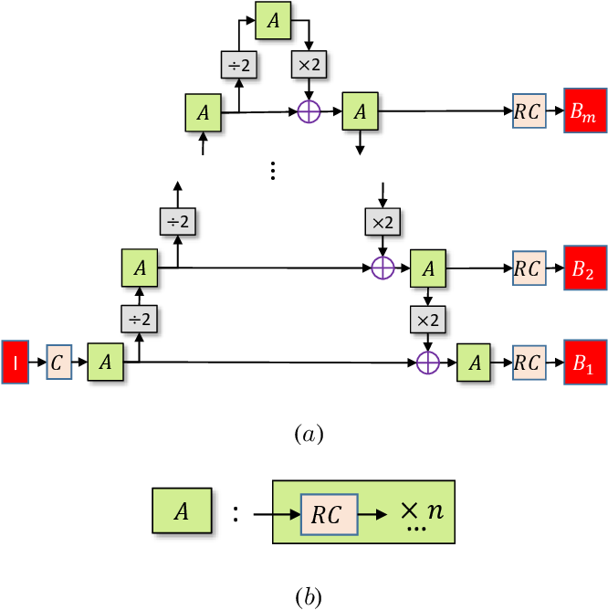
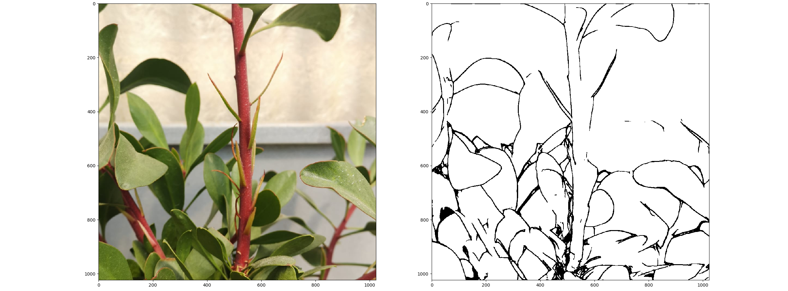

# Pyramid CNN for plants leaves segmentation

This repo contains my implementation of the network presented in the paper [A Pyramid CNN for Dense-Leaves Segmentation](https://arxiv.org/abs/1804.01646) 
using the popular DL framework PyTorch.

Here's the architecture of the network as presented in the aforementioned paper:



As an additional note, my implementation should be taken as 'loose' in the sense that I followed most of the design choices presented in the paper by my own
interpretation but this is by no mean a direct 'porting' of the official repo provided by the
very author of the paper 'Daniel D. Morris', which I link here https://github.com/dmorris0/PyramidCNN
in appreciation of the work done by the author. I didn't make use of the resources provided,
as I don't enjoy MATLAB very much (sorry! :stuck_out_tongue_closed_eyes:) 
but definitely do drop a star to the repo if it has been useful to you!
___
## Usage
Following the workflow of a training from scratch of the network, you should first download
the dataset released alongside the paper from https://www.egr.msu.edu/denseleaves/.
Some pre-processing and transformations are applied to the original dataset -notably each 
image is cropped following a simple sliding window logic, producing multiple samples- 
in order to have a more suitable format for the PyTorch Dataset extension, and you can do so by
running the following command:

```python3 generate_preprocessed_dataset.py DenseLeaves_DATASET_PATH_HERE [patch_size] [subdir_to_process] [output_directory]```

By default the newly created dataset will be on the same directory as the source dataset 
under a new folder called `leaves_edges`; only non-rotated images are considered from
the original dataset during this process (data augmentation can be applied later).
The same process can be repeated for processing the evaluation and test splits by making use
of the optional parameters. 

Training is performed using:

```python3 train.py -d PROCESSED_DATASET_PATH -s WHERE_TO_SAVE_MODEL -e NUM_EPOCHS```

More info on each argument by triggering the argparse helper. Training follows a very basic 
pattern but you might want to experiment with the weights associated to the multiscale loss
by passing a different tensor through the `loss_weights` parameter to the actual network,  
implemented inside `pyramid_network.py`.

## Pre-trained model
I also provide a pretty hastily pre-trained model (already in the root of this repo since it's very small)
reaching a level of accuracy which was enough for the need of my application 
and of which I report some results in the following section. 
I only needed to have a rough estimate of the leaves contours so I stopped pretty early, I 
suggest you go on training on more (augmented) data to reach better results, for sure.

## Visual Results
>multiscale predictions-original_image-label (at max resolution)
----


Random image I took:

